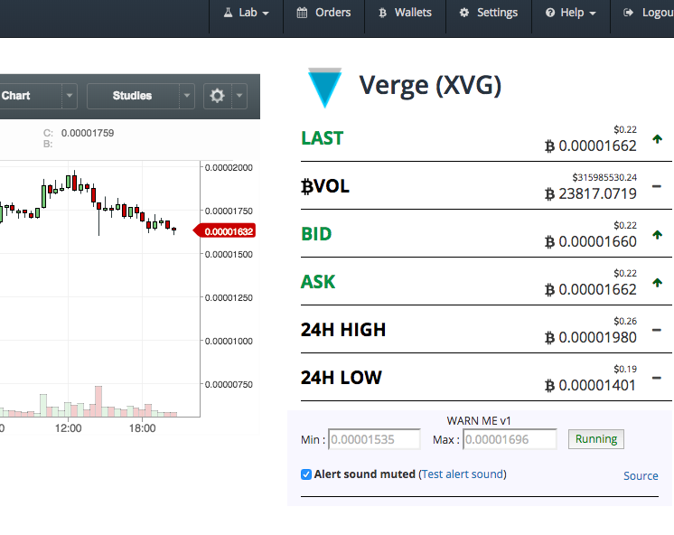

# Chrome alert application for Bittrex

It's so easy to trade now, when you're busy.
Enter trading limits, then minimize window. Keep working.

Current version: 1

### Installation:

* Download codes your PC
* Run your Chrome browser
* Click on Window -> Extensions
* Click on "Developer mode" to activate it
* Click to "Load Unpacked Extension" button and select folder
* For example, wisit https://bittrex.com/Market/Index?MarketName=USDT-BTC and wait 10 seconds

### Follow me on twitter : https://twitter.com/_o_s_i

If you want to donate:

BTC:
13cqsEmzhFic3to8LTQgyDmf8RM2egWDBA

ETH:
0xed7bc59b19cfb0e96523b1312c6f0a6c71a47574

### Screen Shoot:

