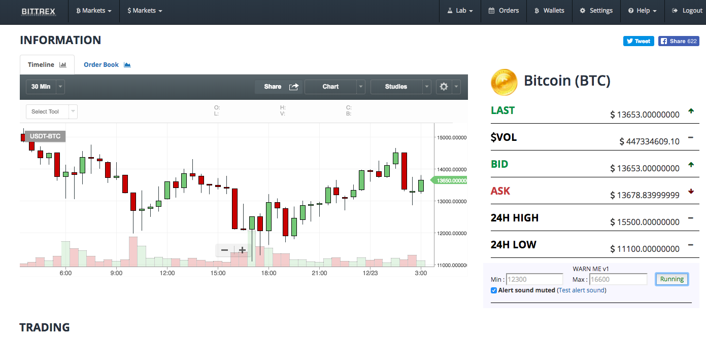

# Chrome alert application for Bittrex

It's easy to trade when you're working on a computer.

Installation:

* Download codes your PC
* Run your Chrome browser
* Click on Window -> Extensions
* Click on Developer mode to activate it
* Click to Load Unpack Extension button and select files in folder
* Open the Bittrex.com web page and start using it

Screen Shoot:

